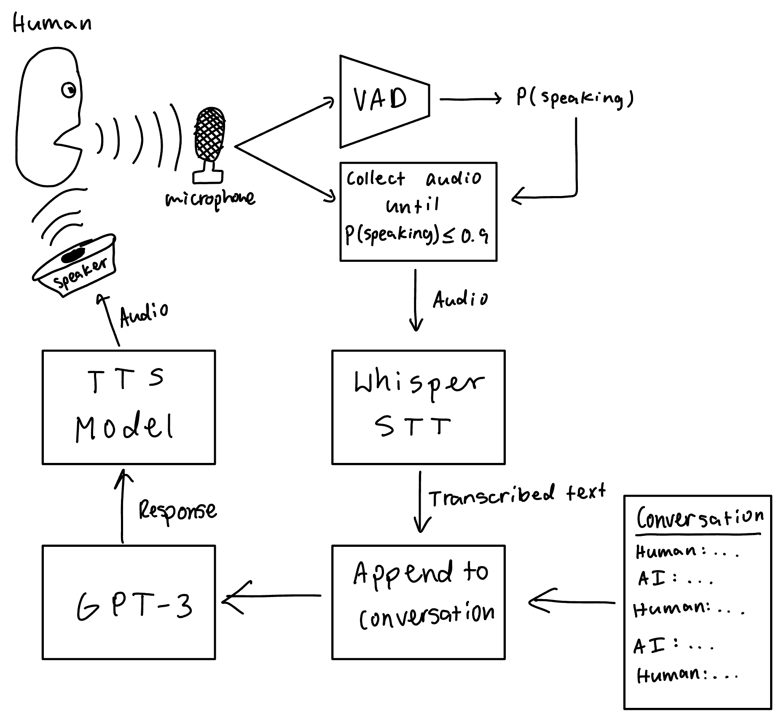

# Jarvis


## Description
This is a conversational voice assistant using OpenAI's GPT-3 language model, a voice activity detection model, OpenAI's Whisper model for, and a text to speech model. The AI can have a conversation with you and leverages GPT-3's conversational abilities. 

## How it works
Audio from the microphone is fed into a voice activity detection model. Once the person stops speaking for 2 seconds, the audio is sent to OpenAI's Whisper model for transcription. This transcribed text is appended to a conversation which is sent to GPT-3. The response created by GPT-3 is then run through a TTS model from the Coqai TTS library. The audio from the TTS model is then played through the speakers.  After this, the process restarts.

## Future work
I hope to add more features to this agent, including the ability to talk in multiple languages, having access to the internet and tools such as calculators, and making it more conversational. Right now, it is slow due to API calls and sequential execution. In the future, I may be able to run models and processes concurrently to decrease the time it takes to make a response. 

## How to Run
If you you have [`pipenv`](https://pipenv.pypa.io/en/latest/), run 
```
$ pipenv install
```
If you had pip, run
```
$ pip install -r requirements.txt
```
After installing the dependencies, run
```
$ python3 main.py
```